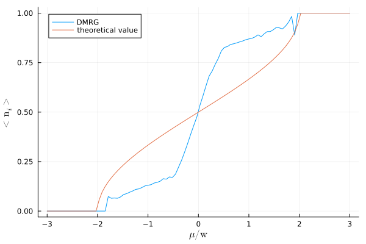

# Density Matrix Renormalization Group (DMRG)
DMRG is an alternative approach to exact diagonalization to solve lattice problems.

xy.jl uses the ITensors library to solve two models, XY and XX, where to solve it means finding the energy and the state of the ground state.

Using this code one can, for example, calculate the mean value over the ground state of the density number operator varying the coupling of the Hamiltonian. 
Using Sachdev's conventions for the variables we can compare our results with Sachdev's from the book Quantum Phase transitions.

We see that we have to improve the algorithm's convergence to obtain better results.

# Benchmark using @time
N = 100 : number of sites

len = 20 : number of coupling points

nsweeps = 6 : number of sweeps

maxdim = [10,20,100,100,200,400] : dimensions of sweep

cutoff = [1E-10] : cutoff

## CPU 

340.140290 seconds (124.41 M allocations: 277.874 GiB, 5.04% gc time, 16.27% compilation time: <1% of which was recompilation) : first run

279.829263 seconds (59.11 M allocations: 261.859 GiB, 3.92% gc time, 0.02% compilation time)

281.817562 seconds (59.11 M allocations: 284.907 GiB, 5.18% gc time, 0.01% compilation time)

## GPU 

237.651582 seconds (308.56 M allocations: 21.239 GiB, 5.39% gc time, 36.08% compilation time: <1% of which was recompilation) : first run

149.709105 seconds (192.41 M allocations: 13.569 GiB, 3.84% gc time, 0.01% compilation time)

154.989209 seconds (192.62 M allocations: 13.576 GiB, 3.73% gc time, 0.04% compilation time)
