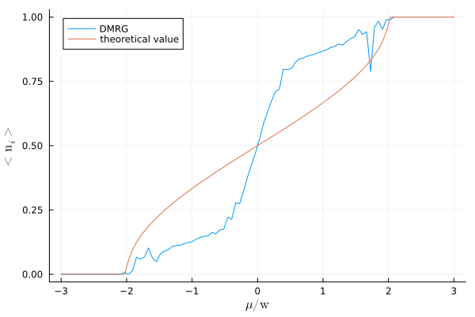

# Density Matrix Renormalization Group (DMRG)
DMRG is an alternative approach to exact diagonalization to solve lattice problems.

xy.jl uses the ITensors library to solve two models, XY and XX, where to solve it means finding the energy and the state of the ground state.

Using this code one can, for example, calculate the mean value over the ground state of the density number operator varying the coupling of the Hamiltonian. 
Using Sachdev's conventions for the variables we can compare our results with Sachdev's from the book Quantum Phase transitions.

We see that we have to improve the algorithm's convergence to obtain better results.
